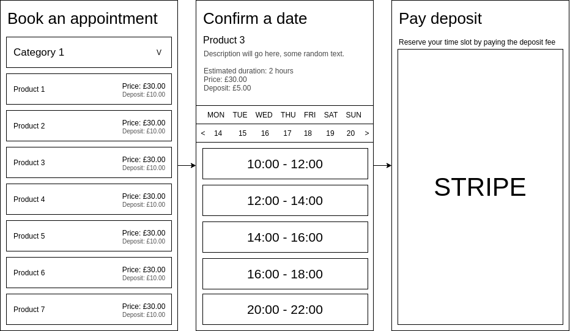
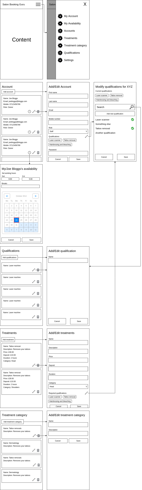

# Wireframes

All wireframes are currently built using [draw.io](https://app.diagrams.net/),
to open the `.xml` files in `wireframes/` simply go to
[https://app.diagrams.net/](https://app.diagrams.net/) and open the files using
their GUI.

Alternatively use your favorite image viewer to open any of the `.png` files.

# Making a booking

# Salon users

