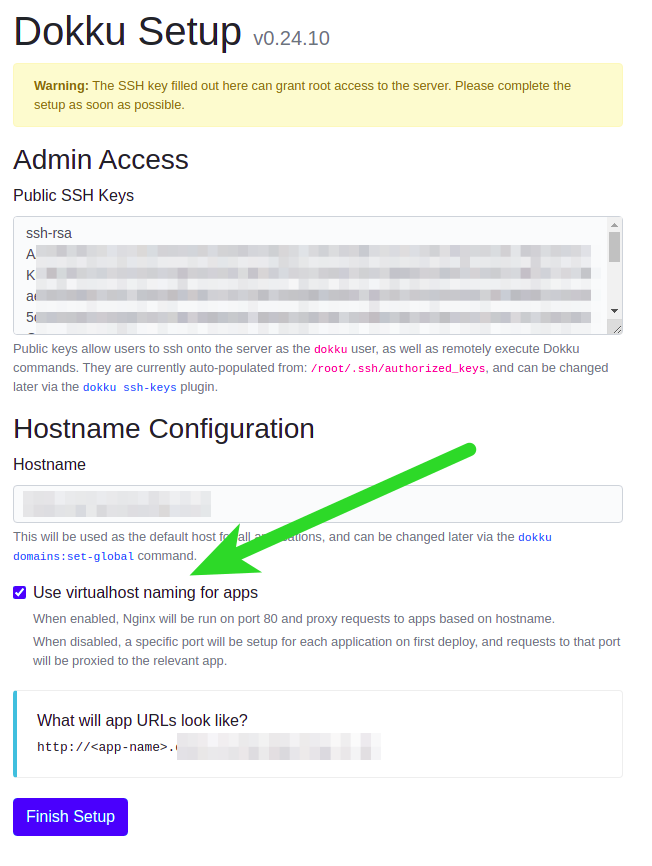

# Deployment

Automatic deployment using Dokku and GitHub Actions

## Deploy a Dokku server

Requirements:

- Ubuntu 20.04 LTS
- [Dokku v0.24.10](https://dokku.com/)
- A domain name with a [DNS A record](https://en.wikipedia.org/wiki/List_of_DNS_record_types) pointing to your dokku server (optional)

## Dokku Installation

### Create dokku swap on small VPS (optional)

For small (cheap) VPS's Dokku will run out of RAM quickly. 
Create a 5GB swap is one way to mitigate this.

```
sudo fallocate -l 5g /mnt/5GiB.swap
sudo chmod 600 /mnt/5GiB.swap
sudo mkswap /mnt/5GiB.swap
sudo swapon /mnt/5GiB.swap
echo '/mnt/5GiB.swap swap swap defaults 0 0' | sudo tee -a /etc/fstab
free -mh
```

### On the VPS install Dokku:

```bash
wget https://raw.githubusercontent.com/dokku/dokku/v0.24.10/bootstrap.sh;
sudo DOKKU_TAG=v0.24.10 bash bootstrap.sh
# This process may take over 10 minutes
```

### Visit in you web browser to complete install

Visit `http://<your-server-ip>`, and complete installation.

> Be sure to click 'Use virtualhost naming for apps:



After you click 'Finish' you'll be redirected to Dokku documentation- you can close that for now, but do read it.

## Dokku configuration
Setup domain (optional)

> If dokku was able to resolve the hostname during install then the dokku domain will have already been added
  check with:
  
```bash

su dokku
dokku domains:report --global
=====> Global domains information
       Domains global enabled:        true                     
       Domains global vhosts:         domain.example.com
```

If not, check your DNS A record is correctly pointing to your server, then configure dokku manually:

```bash
su dokku
dokku domains:add-global <your-domain>
```

## Create database, api, & front-end apps in Dokku


#### Database

```bash
sudo -iu dokku
dokku apps:create salon-booking-guru-database
dokku git:initialize salon-booking-guru-database
dokku git:set salon-booking-guru-database deploy-branch main;
dokku docker-options:add salon-booking-guru-database build --file=/home/dokku/salon-booking-guru-database/Dockerfile;

```

#### API
```bash
sudo -iu dokku
dokku apps:create salon-booking-guru-api
dokku git:initialize salon-booking-guru-api
dokku git:set salon-booking-guru-api deploy-branch main;
dokku docker-options:add salon-booking-guru-api build --file=/home/dokku/salon-booking-guru-api/Dockerfile;

```

#### Front-end
```bash
sudo -iu dokku
dokku apps:create salon-booking-guru-front-end
dokku git:initialize salon-booking-guru-front-end
dokku git:set salon-booking-guru-front-end deploy-branch main;
dokku docker-options:add salon-booking-guru-front-end build --file=/home/dokku/salon-booking-guru-front-end/Dockerfile;

```

## Create shared network

> This is so the `api` and `database` may connect to eachother.

```bash
dokku network:create sharednetwork
```

Attach `database` and `api` to the `sharednetwork`, note that the `front-end` does *not* need to be connected to the `sharednetwork`.

```bash
dokku network:set salon-booking-guru-database attach-post-create sharednetwork
dokku network:set salon-booking-guru-api attach-post-create sharednetwork
```

## Set database credentials

Database credentials get injected into the apps envrionment upon startup. See [12factor app - config](https://12factor.net/config).

```bash
dokku config:set salon-booking-guru-api SALON_BOOKING_GURU_DB_HOST=salon-booking-guru-database.web SALON_BOOKING_GURU_DB_PORT=5432 SALON_BOOKING_GURU_DB_PASSWORD="changeme" SALON_BOOKING_GURU_DB_DBNAME="salon_booking_guru" SALON_BOOKING_GURU_DB_USER="postgres"
...
-----> Setting config vars
       SALON_BOOKING_GURU_DB_DBNAME:    salon_booking_guru
       SALON_BOOKING_GURU_DB_HOST:      salon-booking-guru-database.web
       SALON_BOOKING_GURU_DB_PASSWORD:  changeme
       SALON_BOOKING_GURU_DB_PORT:      5432
       SALON_BOOKING_GURU_DB_USER:      postgres
-----> Restarting app salon-booking-guru-api
-----> Releasing salon-booking-guru-api...
...
-----> Shutting down old containers in 60 seconds
=====> Application deployed:
       http://salon-booking-guru-api.dokku.karmacomputing.co.uk
       http://salon-booking-guru-api.dokku.karmacomputing.co.uk:8085
       https://salon-booking-guru-api.dokku.karmacomputing.co.uk

```

## Dockerfile configuration

For dokku v0.24.10 Dockerfile deployment is only recognised when there is a `Dockerfile` in the root directory of the repository. However this repo has components in subdirectories:

> In an [upcomping release](https://github.com/dokku/dokku/issues/4691#issuecomment-882772065) of Dokku mono repos will be supported.


To workaround this that there is an empty Dockerfile in the root. This forces dokku to treat the apps as docker 
deployments (Dokku supports multiple deployment types).

Additionally, the git hook(s) need to be altered for each app

### Configure Dokku git pre-recieve hook to build correct Dockerfile

> This is [needed](https://github.com/dokku/dokku/issues/4691#issuecomment-882772065) since when docku builds containers the build context is hardcoded to the 
root of the repo.

Add a pre-recieve hook on the dokku server to fetch the `Dockerfile` into the repo:

##### Database

```bash
vi salon-booking-guru-database/hooks/pre-receive
```

```bash
#!/usr/bin/env bash
set -e
set -o pipefail

curl https://raw.githubusercontent.com/KarmaComputing/salon-booking-guru/main/database/Dockerfile > /home/dokku/salon-booking-guru-database/Dockerfile

cat | DOKKU_ROOT="/home/dokku" dokku git-hook salon-booking-guru-database
```

##### API

```bash
vi salon-booking-guru-api/hooks/pre-receive
```

```bash
#!/usr/bin/env bash
set -e
set -o pipefail

curl https://raw.githubusercontent.com/KarmaComputing/salon-booking-guru/main/api/Dockerfile > /home/dokku/salon-booking-guru-api/Dockerfile

cat | DOKKU_ROOT="/home/dokku" dokku git-hook salon-booking-guru-api
```

##### Front-end

```bash
vi salon-booking-guru-front-end/hooks/pre-receive
```

```bash
#!/usr/bin/env bash
set -e
set -o pipefail

curl https://raw.githubusercontent.com/KarmaComputing/salon-booking-guru/main/front-end/Dockerfile > /home/dokku/salon-booking-guru-front-end/Dockerfile

cat | DOKKU_ROOT="/home/dokku" dokku git-hook salon-booking-guru-front-end
```

### Verify dokku apps with git push

To make sure everything is in order, you can manually push to Dokku from your local

The steps are to:

1. Add a git remote for each component (database, api, front-end)
2. Perform a git push
3. Observe the containers running

#### Git add remotes

> **On your local machine**.


```bash
DOKKU_IP=<dokku-ip> # change to your ip address
```

```bash
git remote add dokku-database dokku@$DOKKU_IP:salon-booking-guru-database
git remote add dokku-api dokku@$DOKKU_IP:salon-booking-guru-api
git remote add dokku-front-end dokku@$DOKKU_IP:salon-booking-guru-front-end
```

You can verify remotes with
```bash
git remote -v show
```


## Deploy initial apps

From your local machine, star the deployment of the `database`. `api` and `front-end` apps.


### Deploy database

You will see dokku deploy the database
```bash
git push dokku-database main


Enumerating objects: 594, done.
-----> Cleaning up...
-----> Building salon-booking-guru-database from Dockerfile
remote: dos2unix: converting file Dockerfile to Unix format...
remote: build context to Docker daemon   1.77MB
Step 1/6 : FROM postgres:13.3-alpine
...
=====> Application deployed:
       http://salon-booking-guru-database.dokku.karmacomputing.co.uk
       http://salon-booking-guru-database.dokku.karmacomputing.co.uk:5432

To <ip>:salon-booking-guru-database
 * [new branch]      main -> main
```

### Deploy API

```bash
git push dokku-api

Enumerating objects: 594, done.
Counting objects: 100% (594/594), done.
...
-----> Renaming containers
       Renaming container (04b1f4740169) youthful_cori to salon-booking-guru-api.web.1
-----> Checking for postdeploy task
       No postdeploy task found, skipping
=====> Application deployed:
       http://salon-booking-guru-api.dokku.karmacomputing.co.uk
       http://salon-booking-guru-api.dokku.karmacomputing.co.uk:8085
```


### Deploy front-end

> Note front-end build may take over 5 [minutes to build](https://github.com/KarmaComputing/salon-booking-guru/issues/119)
```bash
git push dokku-front-end
...
-----> Checking for postdeploy task
       No postdeploy task found, skipping
=====> Application deployed:
       http://salon-booking-guru-front-end.dokku.karmacomputing.co.uk
```

Verify front-end app loading:

```
http://salon-booking-guru-front-end.dokku.karmacomputing.co.uk/
```

## Automatic Let's Encrypt TLS Certificate

> Via [dokku-letsencrypt](https://github.com/dokku/dokku-letsencrypt)


### Install Let's Encrypt plugin
```
# as root on dokku
sudo dokku plugin:install https://github.com/dokku/dokku-letsencrypt.git
```
## Setup automatic certs for api and frontend

> Must use a valid email address

```bash
sudo -iu dokku
dokku config:set --global DOKKU_LETSENCRYPT_EMAIL=your@email.tld
```

### Certificate generation
```bash
# API
dokku letsencrypt:enable salon-booking-guru-front-end
# Front-end
dokku proxy:ports-add salon-booking-guru-api http:80:8085
dokku letsencrypt:enable salon-booking-guru-api
dokku proxy:ports-add salon-booking-guru-api https:443:8085

```


## Troubleshooting


#### Dokku `apps command not found`

Check ~/.ssh/authorized keys / root to ensure the ssh command includes
```
command="`cat /home/dokku/.sshcommand` $SSH_ORIGINAL_COMMAND" ssh-rsa <the key>
```

#### How do I know the database is connected OK

See [healthcheck endpoint](https://github.com/KarmaComputing/salon-booking-guru/issues/95).

Tail the logs of the app, and observe `Connection to the database established`.
```
dokku@dokku:~$ dokku logs -t salon-booking-guru-api
2021-08-01T20:48:32.183932807Z app[web.1]: 2021/08/01 20:48:32 Listening on :8085
2021-08-01T20:48:32.521738711Z app[web.1]: 2021/08/01 20:48:32 Connection to the database established
```

##### How to force a rebuild/reload of an app
 

Example rebuilding the database and api see [Dokku rebuilding apps](https://dokku.com/docs/processes/process-management/#rebuilding-apps)
```bash
dokku ps:rebuild salon-booking-guru-database
dokku ps:rebuild salon-booking-guru-api
```

##### Access denied when pushing from local

It's possible your ssh key is not configued with dokku. Either use `ssk-copy-id` or:

```bash
cat ~/.ssh/id_rsa.pub | ssh root@<your-vps-ip-address> dokku ssh-keys:add mylocal
```

##### Docker options not set / building wrong Dockerfile

> Check  the docker-options. `dokku docker-options:report salon-booking-guru-front-end`
  If you need to reset them:

>  1. take a copy of *all* existing settings
   `dokku docker-options:report salon-booking-guru-front-end`
  2. Clear the options `dokku docker-options:clear`
  3. Add the settings back you want for each stage
     e.g. `dokku docker-options:add salon-booking-guru-front-end deploy --restart=on-failure:10`


If you get the following error: `remote: unable to prepare context: unable to evaluate symlinks in Dockerfile path: lstat /home/dokku/salon-booking-guru/api: no such file or directory`. This means that the Dockerfile is not already on the Dokku servers repository, make sure that its already there and check the pre-recieve hook so that it has the correct URL to the Dockerfile. It must start with `raw.githubusercontent.com`.


## Github Actions setup

### Credentials

The Github Dokku action needs to be able to ssh into the Dokku server.

On the dokku server, generate a keypaid for Github to use;
```
su dokku
ssh-keygen # Press enter, generate key without passphrase
```

Allow the key to be used by Github
```
cat ~/.ssh/id_rsa.pub >> ~/.ssh/authorized_keys
```

Copy the private key to Gituub secrets e.g. `https://github.com/<org>/<repo>/settings/secrets/actions`
as `SSH_PRIVATE_KEY`.

```
cat ~/.ssh/id_rsa # Copy into GitHub secrets as SSH_PRIVATE_KEY
```

Also set `DOKKU_HOST` to the ip address or hostname of your dokku server.

## Hardening
#### Disable Password based authentication
- Verify your ssh access working with key based access (`ssh root@<your-ip>`) # login without a password
- Disable ssh password based authentication 
  - Open `/etc/ssh/sshd_config` 
  - Change the line `#PasswordAuthentication yes` to `PasswordAuthentication no`
